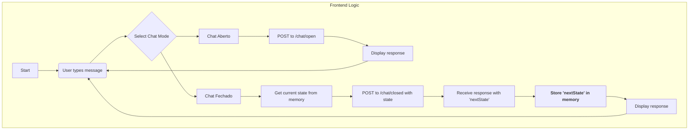

# Guia de Integração Frontend para a Chatbot API

Este guia detalha como o frontend deve interagir com a API do chatbot, cobrindo os dois modos de conversa: Chat Aberto (IA) e Chat Fechado (Guiado).

## O Contrato da API: O Que o Frontend Precisa Saber

Seu frontend terá dois modos de operação, cada um conversando com um endpoint diferente.

### 1. Modo: Chat Aberto (Conversa com IA)

Este é o modo mais simples, ideal para conversas livres.

- **Endpoint:** `POST https://chatbot-api-32gp.onrender.com/chat/open`
- **Quando usar:** Quando o usuário está no modo de conversa livre com a IA.
- **O que enviar (Request Body):**
  ```json
  {
    "message": "Qual é o meu nome?",
    "userId": "1",
    "channel": "web"
  }
  ```
- **O que esperar (Response Body):**
  ```json
  {
    "response": "Seu nome cadastrado é João Silva.",
    "success": true,
    "error": null
  }
  ```
- **Lógica do Frontend:**
  1. Pega a mensagem do usuário.
  2. Envia para o endpoint `/chat/open`.
  3. Exibe o campo `response` da resposta na tela.
  4. Não há estado para gerenciar aqui. Cada pergunta é independente.

---

### 2. Modo: Chat Fechado (Fluxo Guiado)

Este modo é um pouco mais complexo, pois o frontend precisa gerenciar o estado da conversa.

- **Endpoint:** `POST https://chatbot-api-32gp.onrender.com/chat/closed`
- **Quando usar:** Quando o usuário está no fluxo de menu guiado.
- **A Regra de Ouro:** O frontend **deve** armazenar o objeto `nextState` que recebe da API e enviá-lo de volta como o objeto `state` na próxima requisição.

#### Fluxo da Conversa

1.  **Primeira Mensagem (Iniciando a conversa):**
    - O frontend envia uma requisição sem mensagem e com o estado nulo.
    - **Request Body:**
      ```json
      {
        "message": "",
        "state": null,
        "channel": "web"
      }
      ```

2.  **Resposta da API:**
    - A API responde com a primeira pergunta e o estado inicial.
    - **Response Body:**
      ```json
      {
        "response": "Olá! Para começar...",
        "success": true,
        "nextState": { "currentState": "AWAITING_USER_TYPE", "data": {} }
      }
      ```
    - **Ação do Frontend:** Armazenar o objeto `nextState` em uma variável de estado (ex: `useState` no React).

3.  **Mensagens Subsequentes:**
    - O usuário responde (ex: "1").
    - O frontend pega essa resposta e envia junto com o estado que guardou.
    - **Request Body:**
      ```json
      {
        "message": "1",
        "state": { "currentState": "AWAITING_USER_TYPE", "data": {} },
        "channel": "web"
      }
      ```

4.  **Resposta da API:**
    - A API responde com a próxima pergunta e o **novo** estado.
    - **Response Body:**
      ```json
      {
        "response": "Entendido. Para continuar, por favor, informe seu CPF...",
        "success": true,
        "nextState": { "currentState": "AWAITING_STUDENT_CPF", "data": {} }
      }
      ```
    - **Ação do Frontend:** Substituir o valor da variável de estado pelo novo `nextState`.

O ciclo se repete até que `nextState.currentState` seja `"END"` ou `nextState` seja `null`.

## Briefing de Exemplo para a IA

Você pode usar o prompt abaixo para pedir que uma IA de codificação crie o componente de chat para você:

> Crie um componente de chat em React (ou Vue/Angular) com as seguintes características:
>
> **1. Interface do Usuário:**
> - Uma área para exibir o histórico de mensagens (do usuário e do chatbot).
> - Um campo de input de texto para o usuário digitar.
> - Um botão de "Enviar".
> - Um botão ou toggle para alternar entre os modos "Chat Aberto (IA)" e "Chat Fechado (Guiado)".
>
> **2. Funcionalidade do "Chat Aberto (IA)":**
> - Ao enviar uma mensagem, faça uma requisição `POST` para `https://chatbot-api-32gp.onrender.com/chat/open`.
> - O corpo da requisição deve ser: `{ "message": "...", "userId": "1", "channel": "web" }`.
> - Exiba o campo `response` da resposta da API como a mensagem do chatbot.
>
> **3. Funcionalidade do "Chat Fechado (Guiado)":**
> - Use uma variável de estado no React (useState) chamada `chatState` para armazenar o estado da conversa, iniciando como `null`.
> - Ao ativar este modo pela primeira vez (ou ao limpar o chat), envie uma requisição inicial `POST` para `https://chatbot-api-32gp.onrender.com/chat/closed` com o corpo: `{ "message": "", "state": null, "channel": "web" }`.
> - Para todas as mensagens seguintes do usuário, envie uma requisição `POST` para o mesmo endpoint, mas o corpo deve conter a mensagem do usuário e o `chatState` atual: `{ "message": "...", "state": chatState, "channel": "web" }`.
> - Após cada resposta da API, atualize a variável `chatState` com o valor de `nextState` recebido no corpo da resposta.
> - Exiba o campo `response` da resposta da API como a mensagem do chatbot.
> - Se `nextState.currentState` for `"END"`, desabilite o campo de input.

## Diagrama da Lógica do Frontend

